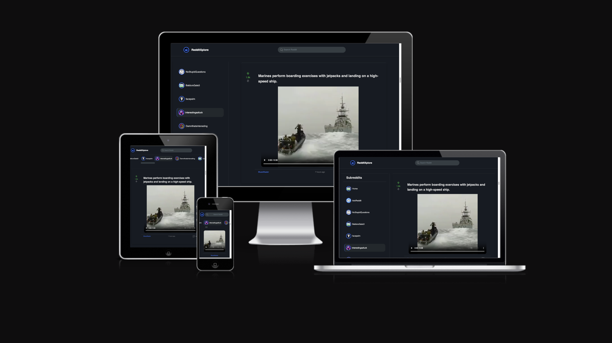

# RedditXplore

---

## Table of Contents

- [General Info](#general-info)
- [Live Version](#live-version)
- [Technologies](#technologies)
- [Features](#features)
- [Bug Fixes](#bug-fixes)
- [Unit Tests](#unit-tests)
- [Status](#status)
- [Future Work](#future-work)
- [Contact](#contact)
- [License](#license)

## General Info

RedditXplore is an intuitive web application that allows users to browse and search for posts from various subreddits. Users can view comments, like and dislike posts, and search for specific topics. This app was created as a portfolio project as part of Codecademy's Full Stack Engineer course.

## Live Version

The live version of the application can be accessed here: [https://redditxplore.netlify.app](#).

Note: You do not need to log in to your Reddit account to interact with the posts. You can like and dislike posts, but these interactions will reset upon reloading the browser as the app does not send POST requests to Reddit and only fetches data from their API.

## Technologies

The project is created with:

- React
- TypeScript
- SCSS
- Redux Toolkit
- Axios
- Jest
- React Testing Library
- Git (for version control)

## Features

The Reddit App boasts several features and functionalities, including:

- **SideBar with Subreddit Categories**: Displays a list of popular subreddits fetched from the Reddit API, allowing users to click on a subreddit to view its posts.
- **PostList Component**: Fetches and displays popular Reddit posts on the initial load and updates posts based on the selected subreddit. Users can like, dislike, and view comments on posts.
- **SearchBar Component**: Allows users to search for topics and view the corresponding posts.
- **Responsive Design**: Utilizes mixins for handling different screen sizes, ensuring the app looks good on all devices.

## Bug Fixes

- **Undefined Error in formatNumbers Utility Function**: Added a check to return '0' if the input number is null or undefined to avoid console errors.
- **Missing Key-Value Pairs in searchPosts Thunk**: Added num_comments, url, preview, and thumbnail to the list of key-value pairs mapped in the searchPosts asynchronous thunk to ensure complete post information is fetched and displayed.

## Unit Tests

- **Navigation Slice**:
  - Tested initial state and action handlers (`setQuery`, `clearQuery`, `resetNavigation`, `setSubreddit`).
  - Verified selectors for `query`, `shouldNavigate`, and `subreddit`.
- **Posts Slice**:
  - Tested initial state and action handlers (`upvote`, `downvote`).
  - Verified async actions (`fetchPosts`, `fetchSubredditPosts`, `searchPosts`, `fetchComments`) using `axios-mock-adapter`.
- **Subreddits Slice**:
  - Tested initial state and action handlers.
  - Verified async action (`fetchSubreddits`) using `axios-mock-adapter`.

## Status

The project is complete and fully functional. Regular updates and improvements may be carried out in the future.

## Future Work

1. **Local Storage**:

- Save users' likes and dislikes in the browser's local storage.

2. **Load More Posts Functionality**:

- Implement a “Load More Posts” button to allow users to load additional posts beyond the initially fetched ones. This will enhance user experience by providing seamless access to more content without excessive initial loading times.

3. **Load More Comments Button**:

- Introduce a “Load More Comments” button to enable users to load additional comments beyond the initial batch. This feature aims to improve the usability of the application.

These future enhancements are aimed at improving the overall functionality and user experience of the application.

## Contact

Created by [Stoyan Peev](https://stoyanvisuals.com)

- Website - [https://stoyanvisuals.com](https://stoyanvisuals.com)
- Email - [info@stoyanvisuals.com](mailto:info@stoyanvisuals.com)
- X / Twitter - [@stoyanvisuals](https://twitter.com/stoyanvisuals)

## License

This project is licensed under the MIT License. You're welcome to view, modify, and distribute the code as per the terms of the MIT License. For more details, see the [MIT License](https://opensource.org/licenses/MIT).

[Back To The Top](#reddit-app)
